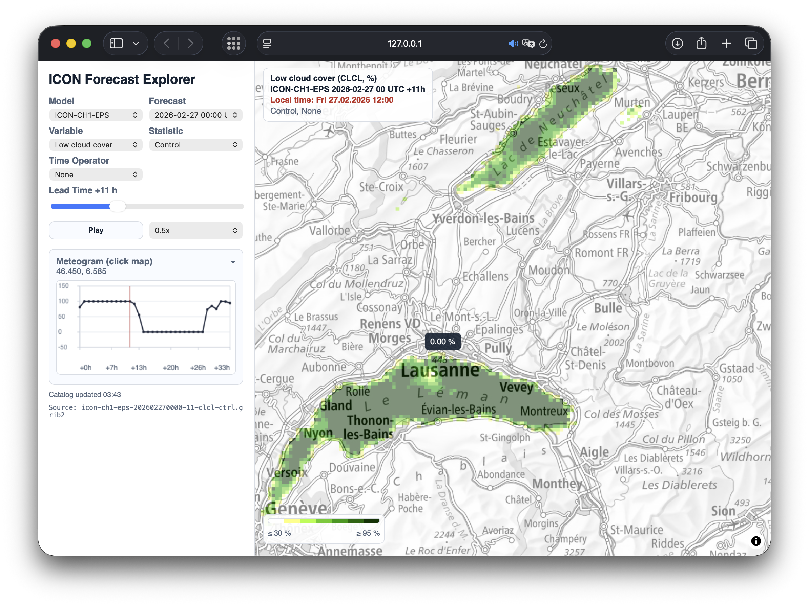

# ICON Forecast Explorer

Interactive web app for visualizing MeteoSwiss ICON forecast fields (ICON-CH1/CH2 EPS control + percentiles).



## Quick Start

```bash
python3 -m venv .venv
source .venv/bin/activate
pip install -r requirements.txt
uvicorn app:app --reload
```

Open [http://127.0.0.1:8000](http://127.0.0.1:8000)

For debug logging:

```bash
LOG_LEVEL=DEBUG uvicorn app:app --reload
```

## Current Features

- Map-based field rendering with in-map summary and compact in-map legend.
- Delayed centered `Loading...` overlay (to avoid flicker during short loads/animation).
- Wind vectors overlay for `10 m wind speed`.
- Meteogram for clicked location (`control`, `p10`, `p90`).
- Time operators for all variables:
  - `None`
  - `Avg 3h`, `Avg 6h`, `Avg 12h`, `Avg 24h`
  - `Acc 3h`, `Acc 6h`, `Acc 12h`, `Acc 24h`
  - `Min 3h`, `Min 6h`, `Min 12h`, `Min 24h`
  - `Max 3h`, `Max 6h`, `Max 12h`, `Max 24h`
- Lead selector quantized by selected time-operator period.
- Unit normalization and de-aggregation logic for from-reference accumulated/averaged GRIB fields.

## Runtime Configuration

- `LOG_LEVEL` (`INFO` default; `DEBUG` recommended for troubleshooting)
- `ICON_LOG_LEVEL` (legacy fallback; `LOG_LEVEL` takes precedence)
- `ICON_LOG_FILE` (`logs/icon_forecast.log` default)
- `CORS_ALLOW_ORIGINS` (comma-separated allowlist)
- `ICON_EXPLORER_ALLOW_ALL_CORS=1` (allow all origins)
- `HOT_PREWARM_ENABLED` (`1` default)
- `HOT_PREWARM_VARIABLES` (`t_2m,tot_prec` default)
- `BACKGROUND_FETCH_WORKERS` (`2` default)

## Cache Behavior

- Field and wind-vector caches are stored as compressed `.npz`.
- Cache keys include `dataset/type/variable/time_operator/init/lead`.
- Corrupt/truncated cache files are automatically dropped and refetched.

## Core API Endpoints

- `GET /api/metadata`
- `GET /api/tiles/{dataset_id}/{variable_id}/{init}/{lead}/{z}/{x}/{y}.png?type_id=...&time_operator=...`
- `GET /api/value?...`
- `GET /api/series?...`
- `GET /api/prefetch?...`
- `GET /api/field-debug?...`
- `GET /api/wind-vectors?...`

## Tests

```bash
PYTHONPATH=. .venv/bin/python -m unittest discover -s tests -p "test_*.py"
```

## Troubleshooting

1. Start with `LOG_LEVEL=DEBUG` and watch server logs.
2. Check browser network calls for:
   - `/api/metadata`
   - `/api/tiles/...`
   - `/api/field-debug`
   - `/api/value`
3. If frontend looks stale, hard refresh (`Cmd+Shift+R`) to bypass static cache.
